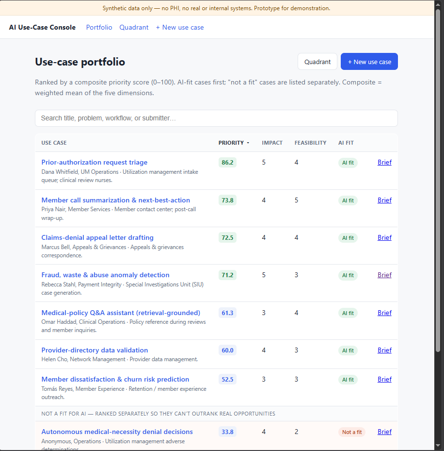
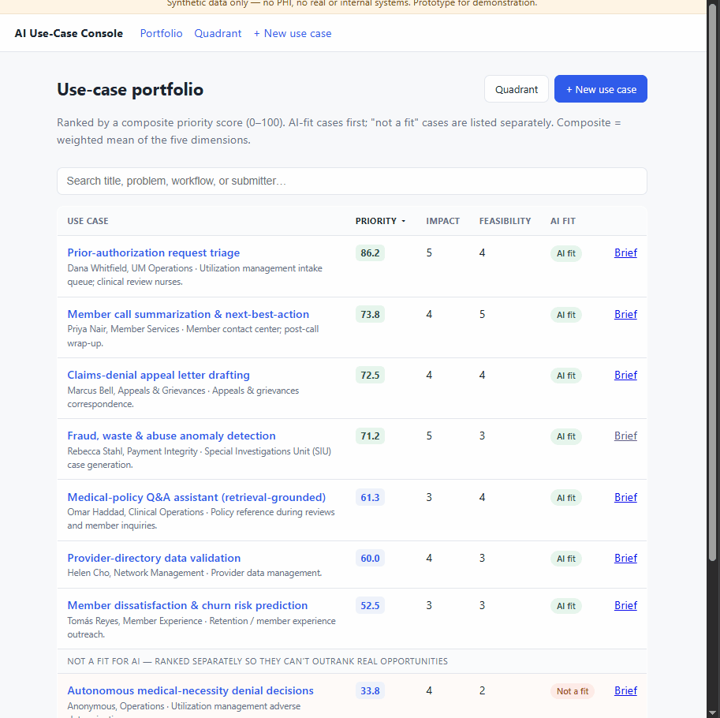

<!--
AI Use-Case Intake & Prioritization Console — case study draft for tjromack.com/work/ai-usecase-intake-console.
Written to the site standard (cf. /work/mcp-suite): metadata block, then Overview · The Problem ·
Constraints · Architecture · Key Decisions · How It's Verified · What I'd Do Differently · Limits · Closing.
Mixed first/third person, past tense, terse. Voice per repo CLAUDE.md: state the numbers, no honesty-signalling.
Every figure is reproducible from the repo — `make eval`.

Images: portfolio.png and score_card.gif live in this folder; paths below are relative to it — repoint to the
site's asset paths when porting into the site repo.
-->

# AI Use-Case Intake & Prioritization Console — where AI does and doesn't belong

**Shipped:** Aug 2026 · hardened Sep 2026
**Demonstrates:** structured AI-opportunity intake with LLM-proposed, human-overridable scoring across five dimensions — including a "when not to use AI" guardrail — with the scoring checked for stability, guardrail recall, and rubric adherence
**Lenses:** Product & delivery (primary), Applied AI
**Stack:** python · fastapi · jinja · htmx · sqlite · anthropic-api

> A console for running an AI-opportunity pipeline: structured intake, LLM-proposed scoring across five dimensions that a
> human can override, and a prioritized portfolio — where the cases that are a poor fit for AI are flagged and ranked
> separately, so a bad idea can't outrank a good one.

## Overview

The console is the tool an AI-innovation function would use to turn a stream of proposed ideas into a ranked, explainable
portfolio. Each use case enters through a structured intake — problem, affected workflow, data availability, stakeholders,
current pain — and is scored across five dimensions (Impact, Feasibility, Risk, Adoption, Strategic Value), each with a
written rationale and an ROI hypothesis. A composite priority score orders the portfolio, an impact/feasibility quadrant
plots it, and a one-page decision brief summarises any single case for an executive audience.

The distinctive output is the negative one. A case judged a poor fit for AI is labelled **"Not a fit"** and ranked
separately, so it cannot outrank a real opportunity — the judgment about where AI does *not* belong is a first-class part
of the portfolio, not an omission. And the model never decides: it proposes every score, and a human can override any
value.

*The portfolio, ranked by a composite priority score across five dimensions. Cases judged a poor fit for AI — an
autonomous medical-necessity denial, here — are labelled "Not a fit" and ranked separately, so they can't outrank real
opportunities.*

## The Problem

Organizations adopting AI accumulate more ideas than they can act on, with no consistent way to compare them. Decisions
get made on enthusiasm rather than evidence, nobody records *why* an idea was greenlit, parked, or rejected, and the
result is wasted pilots and no audit trail.

The judgment that is hardest — and least served by the usual "AI opportunity" tooling — is the negative one: which ideas
AI should *not* touch. A console that scores everything as an AI opportunity, and ranks a case that should never be
automated alongside one that should, is worse than a spreadsheet, because it lends the bad idea a number.

## Constraints

- **Synthetic, authored data only** — no PHI, no real claims or members. The seed is a small set of realistic
  healthcare-payer use cases.
- **The model proposes; a human decides.** Every score is a proposal the reviewer can override; nothing is prioritised or
  approved automatically.
- **A score has to be explainable.** Each dimension carries a rationale — an unexplained number is not usable for a
  portfolio decision.
- **A privacy-preserving path had to exist.** A local-model (Ollama) option runs scoring with no external calls, for a
  sensitive environment.
- **The scoring has to be checkable**, not asserted — stability, the "not a fit" guardrail, and rubric adherence are
  measured.

## Architecture

The flow is intake → score → rank → brief. **Intake** captures the structured fields for a use case. **Scoring** sends
those fields to the configured provider (a frontier model, a local Ollama model, or a deterministic stub) and gets back a
score per dimension with a rationale and an ROI hypothesis; a composite priority score is the weighted mean. The
**"not a fit" flag** is part of that judgment — a poor-fit case is marked and sorted into a separate band. The
**portfolio, quadrant, and brief** are views over the stored scores.

Human override is the spine, not a feature bolt-on: the reviewer opens a use case, sees the proposed score card with its
rationales, and can override any dimension; the record is append-only, so the history of proposal and override is kept.

*Opening a use case shows the LLM-proposed score card — each dimension with its rationale — and a human can override any
value. The model proposes; a person decides.*

The scoring is evaluated by its own harness (`make eval`), which re-scores the seed set with the configured provider and
checks the three properties the console claims: that re-scoring is stable, that the poor-fit cases are flagged, and that
every score carries its rationale.

## Key Decisions

1. **The model proposes; a human decides.** Every dimension is an overridable proposal, and nothing is prioritised
   automatically — the console is a decision aid, not a decision maker. The tradeoff is that a person stays in the loop,
   which for a portfolio decision is the point.
2. **Explainability is a feature, not a nicety.** Every score carries a per-dimension rationale and an ROI line, because
   a number a reviewer cannot defend is a number they cannot use. The tradeoff is more model output to produce and to
   check for adherence.
3. **"Not a fit for AI" is a first-class output, ranked separately.** The negative judgment is surfaced and sorted into
   its own band, so a case that should never be automated cannot outrank a real opportunity. The tradeoff is that the
   flag is a judgment prompt, not a policy engine — a human still weighs it.
4. **The scoring is checkable.** `make eval` measures re-scoring stability, the recall of the "not a fit" guardrail, and
   rubric adherence — so "explainable and consistent" is a number, not a claim. The tradeoff is that it runs on a fixed
   synthetic seed and is calibrated to a rubric, not to human raters.
5. **A local-model option.** Ollama runs the whole scoring path locally with no external calls, a privacy-preserving
   deployment for a sensitive environment. The tradeoff is local-model quality against a frontier model's.

## How It's Verified

`make eval` re-scores the synthetic seed with the configured provider and checks the three properties the console claims.
Real output:

| Check | Result |
|---|---|
| Guardrail — the "not a fit for AI" cases are flagged | **3 / 3** (100%) |
| Rubric adherence — a rationale per dimension + an ROI line, on every score | **30 / 30** (100%) |
| Stability — composite-score spread across three real-model re-scorings | **mean 5.71, max 17.4** (points, 0–100 scale) |
| Automated suite (offline; passes cold, without a seed) | **40 tests** |

The eval runs offline on a deterministic stub by default (so it always works), and names the provider that produced the
numbers; the stability figure above is from re-scoring on the real model, where run-to-run variance is the property worth
measuring.

## What I'd Do Differently

The subtle trap was in the eval, not the console: on the deterministic stub the stability check reports a spread of 0.0,
which *looks* like perfect consistency but measures nothing. The property that matters — an LLM's run-to-run variance —
only appears with a real provider, and there it is real: composite scores drift a mean of 5.7 points across re-scorings,
up to 17 on one case. A stub's 0.0 would have hidden that entirely, so I would make the distinction loud from the start.
That variance is also the argument for the other change: ten authored use cases exercise the pipeline end to end but are
not a real portfolio, and the scores are calibrated to a rubric rather than to human raters — I would grow the set and
add a second scorer to report inter-rater agreement, since the model alone moves a case by up to 17 points.

## Limits

- **A decision aid, not a decision maker.** The model proposes; a human reviews and can override every value. Nothing is
  prioritised, approved, or funded automatically.
- **Ten synthetic use cases** — a small authored set for a healthcare-payer context, enough to exercise intake, scoring,
  and ranking end to end, not a real portfolio, and carrying no real claims, members, or PHI.
- **Rubric-calibrated, not rater-calibrated.** The eval checks stability and rubric adherence; it does not measure
  agreement with expert human scorers.
- **The "not a fit" flag is a judgment prompt, not a policy engine** — it surfaces a likely poor fit for a human to
  weigh, not a compliance gate.

## Closing

The repo is linked at the top of this page. `make eval` prints the scoring report — stability, guardrail recall, and
rubric adherence — and runs offline on a stub or against a real (or local Ollama) provider. Inside the app, the portfolio
ranks the opportunities, the quadrant plots them, and each use case carries a one-page decision brief.
